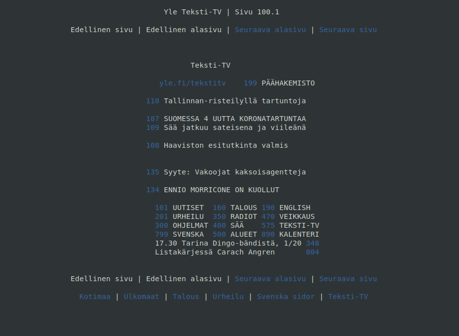

# Yle Teksti-TV
Terminal application for reading [Yle Teksti-TV](https://yle.fi/tekstitv/txt/100_0001.htm)




## Usage

To open the first page view, you can just start the program without arguments:
```
$ tekstitv
```

If you want to open certain page, just add the page number as an argument:
```
$ tekstitv 101
```

To print the page to standard output just add `-t` option:
```
$ tekstitv 101 -t
```

You can see all the command line options with `-h` option:
```
$ tekstitv -h
```

## Navigation

You can navigate the tekstitv application with following key commands.
<br />
You can also see the navigation guide with `--navigation` and `--long-navigation` options
<br />
Up, Right, Down, Left refers to the arrow keys

| Key | Action | Info |
| --- | ------ | ---- |
| j/Down | Move one link down | - |
| k/Up | Move one link up | - |
| l/Right | Move one link right | - |
| h/Left | Move one link left | - |
| g/Enter | Open the selected link | - |
| v | Load previous page | Tries to load page only if it exists |
| m | Load next page | Tries to load page only if it exists |
| b | Load previous sub page | Tries to load page only if it exists |
| n | Load next sub page | Tries to load page only if it exists |
| s | Search new page | Automatically tries to load the page after 3 digits |
| o | Previous page | - |
| p | Next page | - |
| i | Show navigation help | - |
| esc | Cancel search mode | Works only in search mode |
| q | Quit program | Works only if *not* in search mode |

## Configuration

Configuration file can be set to `~/.config/tekstitv/tekstitv.conf`
or with `--config` option.
<br>
[tekstitv.conf.example](tekstitv.conf.example) explains how config file is structured.
<br>
You can see all the options valiable with `--help-config` option.


## Installing debian packages

You can find prebuild debian packages [here](https://github.com/Nykseli/yle-tekstitv/releases)

## Building and installation

Building this program depends on ncurses and libcurl.
<br />
Both gcc and clang are supported

### Debian

```
$ sudo apt-get install libcurl4-openssl-dev libncurses-dev
```

After installing depencies you can install the binary.
<br />
See `./configure --help` for all build options
```
git clone https://github.com/nykseli/yle-tekstitv
cd yle-tekstitv
./configure --prefix=/usr --disable-lib-build
make
sudo make install
```
If you want to enable the bash auto completion without restarting bash session:
```
. ./tekstitv-completion.sh
```

### Termux

If you are using [Termux](https://termux.com/) on android, you can install the program with the provided install script.

```
git clone https://github.com/nykseli/yle-tekstitv
cd yle-tekstitv
./termux_install.sh install
```

Also you can update the program using the script
```
./termux_install.sh update
```
